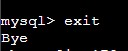
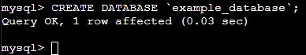
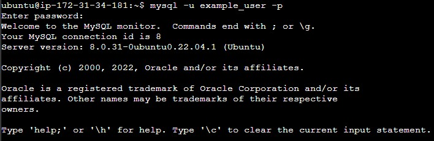

## Implement a Client Server Architecture using MySQL Database Management System (DBMS) ##

**Step 1**

Create and configure two Linux-based virtual servers (EC2 instances in AWS).

Server A name - `mysql server`
Server B name - `mysql client`

Run update on both the mysql client and server

`sudo apt update`

On mysql-server, install MySQL Server software.

`sudo apt install mysql-server`

On mysql-client, install MySQL client software

`sudo intall mysql-client`

By default, both of your EC2 virtual servers are located in the same local virtual network, so they can communicate to each other using local IP addresses. Use mysql server's local IP address to connect from mysql client. MySQL server uses TCP port 3306 by default, so you will have to open it by creating a new entry in ‘Inbound rules’ in ‘mysql server’ Security Groups.

Configure MySQL server to allow connections from remote hosts.

`sudo vi /etc/mysql/mysql.conf.d/mysqld.cnf`

Replace ‘127.0.0.1’ to ‘0.0.0.0’ 

## From mysql client Linux Server connect remotely to mysql server Database Engine using the mysql utility. ##

1.  Log in to the MySQL console in mysql-server by typing

    `sudo mysql`

    

2. Remove some insecure default settings and lock down access to your database system

    `ALTER USER 'root'@'localhost' IDENTIFIED WITH mysql_native_password BY 'PassWord.1';`

    

3. Exit the MySQL shell 

    `exit`

    

4. Create a new database from MySQL console

    `CREATE DATABASE `example_database`;`

    

5. Creates a new user named example_user, using mysql_native_password as default

    `CREATE USER 'example_user'@'%' IDENTIFIED WITH mysql_native_password BY 'password';`

    

6. Give this user permission over the example_database database, then exit

    `GRANT ALL ON example_database.* TO 'example_user'@'%';`

    

7. Test new user's permissions*

    `mysql -u example_user -p`

    

8. Connect remotely to mysql-server from mysql-client and show databases

    `mysql -u example_user -h 172.31.13.110 -p`
    `Show databases`

    ![Connect remotely and show databases](./images/Connect%20remotely%20with%20example_user%20and%20showing%20databases.jp